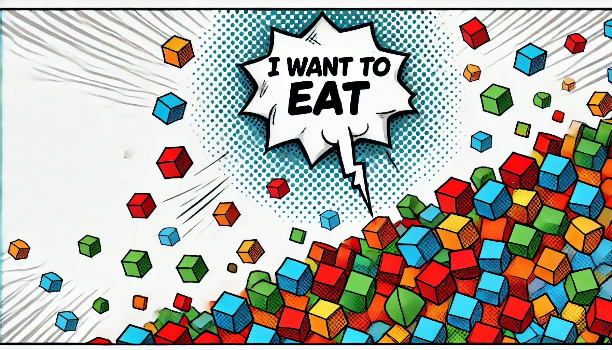

# Creature Simulation

This project simulates a population of evolving creatures in a 2D grid-based environment. Each creature is controlled by a neural network, which dictates its movement and decision to reproduce. The creatures consume energy while moving, gain energy by eating food, and reproduce by splitting their energy with their offspring. The environment simulates the process of evolution with mutation and survival mechanics.

---

## Demo

Here’s a demonstration of the simulation in action:

[](https://www.youtube.com/watch?v=TXiBkSEfN9o)

---

## Features

- Creatures move in a 2D grid, search for food, and make decisions about movement and reproduction using neural networks.
- Creatures consume energy exponentially based on their movement speed and gain energy from food.
- Reproduction occurs when a creature has enough energy, and the parent shares its energy evenly with the child.
- Neural networks mutate slightly during reproduction, allowing for evolutionary changes over time.
- Creatures can only reproduce after a specified number of ticks since birth or the last split.
- Food is continuously added to the environment at a small rate.

---

## Table of Contents

1. [Installation](#installation)
2. [Usage](#usage)
3. [Demo](#demo)
4. [Configuration](#configuration)
5. [Future Improvements](#future-improvements)

---

## Installation

### Requirements

Make sure you have the following installed on your machine:

- Python 3.7 or higher
- `pygame` for rendering the simulation
- `torch` (PyTorch) for the neural networks

### Clone the Repository

Clone the repository from GitHub:

```bash
git clone https://github.com/your-username/creature-simulation.git
cd creature-simulation
```

### Install Dependencies

Install the required Python libraries:

```bash
pip install -r requirements.txt
```

The `requirements.txt` should include:

```txt
pygame
torch
numpy
```

---

## Usage

To run the simulation, simply execute the following command:

```bash
python simulation.py
```

This will launch the simulation window, where you can observe creatures moving around the environment, eating food, and reproducing.

### Controls

- The simulation runs automatically once started.
- To stop the simulation, simply close the window or press `Ctrl + C` in the terminal.

---

## Configuration

You can tweak the simulation parameters directly in the `simulation.py` script to customize the behavior of the creatures:

### General Settings

- **FIELD_SIZE**: Size of the environment grid (default: 160).
- **NUM_CREATURES**: Number of initial creatures in the simulation (default: 80).
- **INITIAL_ENERGY**: Initial energy for each creature (default: 200).
- **ENERGY_GAIN_FROM_FOOD**: The energy gained by a creature when it consumes food (default: 150).
- **NUM_FOOD_ITEMS**: Number of food items in the environment at the start (default: 300).
- **FOOD_ADDITION_RATE**: Probability of adding new food per tick (default: 0.1).

### Movement and Reproduction

- **MAX_SPEED**: Maximum speed a creature can move (default: 0.5).
- **TICKS_BEFORE_SPLIT**: Number of ticks a creature must wait before it can reproduce (default: 225).
- **ENERGY_TO_SPLIT**: Minimum energy required for a creature to reproduce (default: 20).
- **FOOD_EATING_THRESHOLD**: Distance threshold for eating food (default: 0.5).

### Neural Network

- The creatures' neural networks have three outputs:
  1. **Speed**: Controls how fast the creature moves.
  2. **Angular Velocity**: Controls the direction the creature turns.
  3. **Reproduction Decision**: A value determining whether the creature should reproduce.

---

## Future Improvements

- **Predator-Prey Dynamics**: Introduce predators that hunt creatures, adding an additional survival challenge.
- **Food Variety**: Implement different types of food, each providing varying amounts of energy or effects.
- **Complex Neural Networks**: Extend the neural networks to incorporate more decision-making complexity.
- **Better Visualization**: Add a graphical interface to display creature stats or track evolutionary traits over time.

---

## License

This project is licensed under the MIT License. See the [LICENSE](LICENSE) file for details.

---

## Contributing

Contributions are welcome! Feel free to open an issue or submit a pull request if you have improvements or bug fixes.
